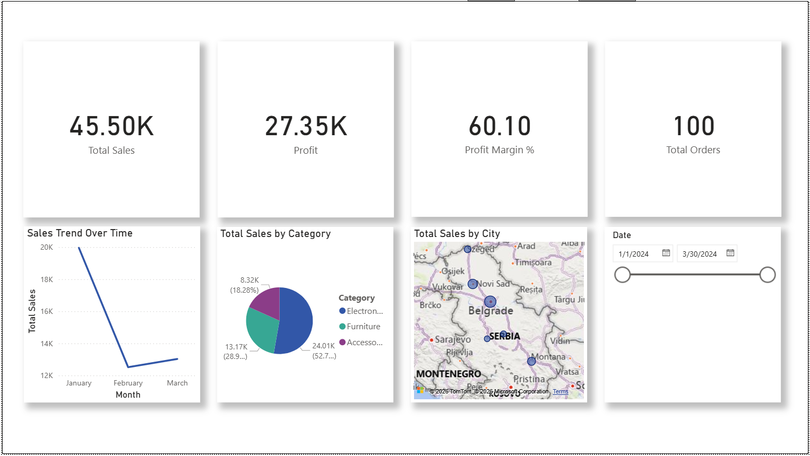
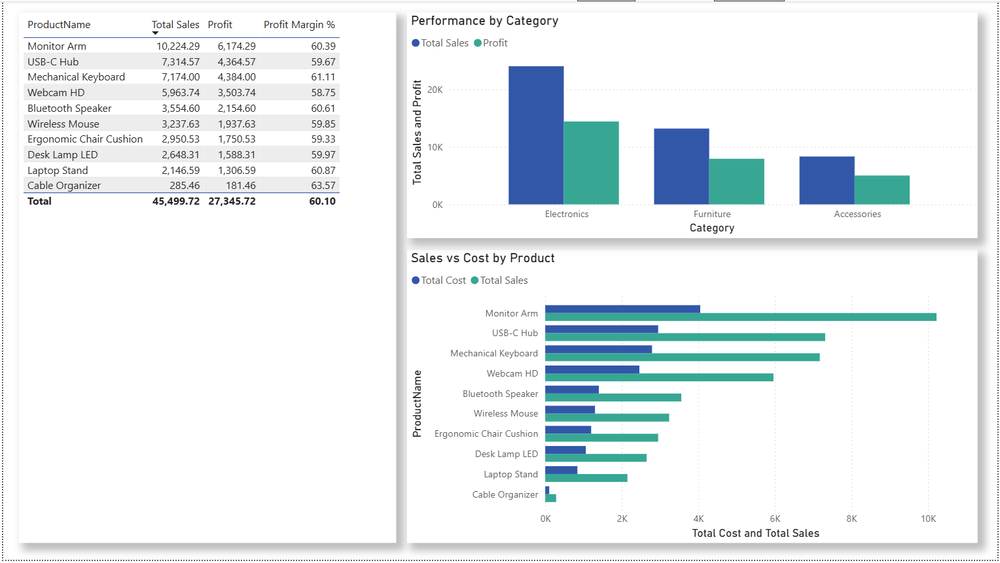
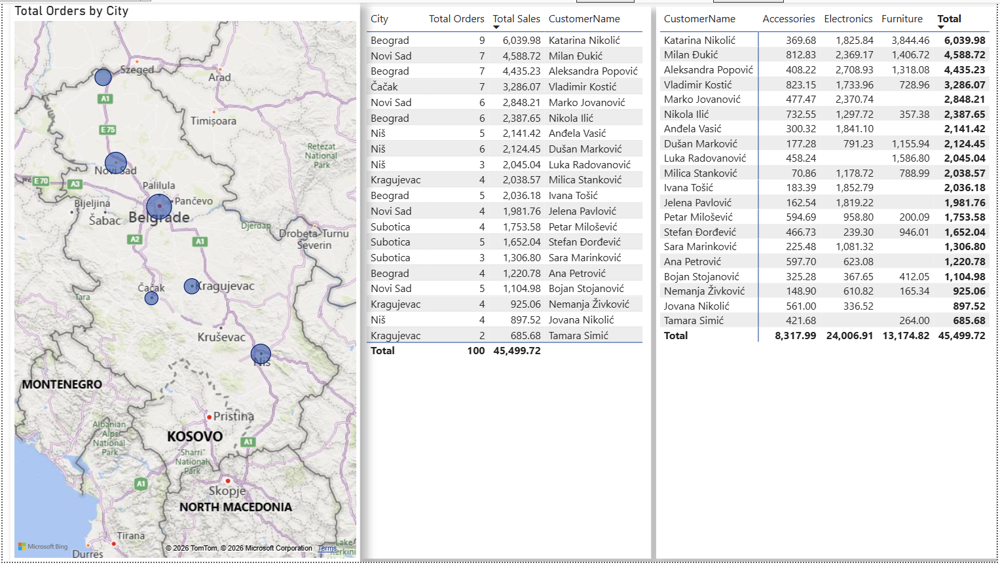

# 📊 Sales Analytics Dashboard - Power BI


## 🎯 Project Overview

Professional Power BI dashboard for sales analysis with realistic data. The project includes multiple connected tables, advanced DAX calculations, and interactive visualizations.

### Key Metrics:
- 📈 **100 transactions** (January - March 2024)
- 🛍️ **10 products** across 3 categories
- 👥 **20 customers** from 6 cities in Serbia
- 💰 Profit analysis and sales trends

---

## 📁 Project Structure

```
sales-analytics-powerbi/
│
├── .gitignore                         # Git ignore rules
├── LICENSE                            # MIT License
├── README.md                          # Project documentation
│
├── Data/
│   └── SalesData.xlsx                 # Excel file with 3 sheets
│
├── Reports/
│   └── SalesAnalytics.pbix            # Power BI dashboard (1.98 MB)
│
└── Screenshots/
    ├── page1_sales_overview.png       # Sales Overview page
    ├── page2_product_analysis.png     # Product Analysis page
    └── page3_customer_insights.png    # Customer Insights page
```

---

## 🚀 Getting Started

### Prerequisites:
- Power BI Desktop ([Download](https://powerbi.microsoft.com/desktop/))
- Excel or CSV reader

### Option 1: Download and Explore (Quick Start)

1. **Download the Power BI file:**
   - Navigate to `Reports/SalesAnalytics.pbix` in this repository
   - Download the file (1.98 MB)
   - Open in Power BI Desktop

2. **Explore the dashboard:**
   - Interact with all 3 pages
   - Examine DAX formulas
   - Filter data using slicers
   - Customize visuals

### Option 2: Build from Scratch (Learning Path)

1. **Clone the repository:**
```bash
git clone https://github.com/nikolakotlaja25-web/sales-analytics-powerbi.git
cd sales-analytics-powerbi
```

2. **Load the data:**
   - Open Power BI Desktop
   - Get Data → Excel
   - Select `Data/SalesData.xlsx`
   - Load all 3 sheets: Sales_Data, Products, Customers

3. **Create the data model:**
   - Build relationships between tables
   - Create DAX measures
   - Design visualizations

---

## 📊 Data

### Sales_Data (100 rows)
| Column | Description |
|--------|-------------|
| OrderID | Unique order ID |
| Date | Transaction date (2024-01-01 to 2024-03-31) |
| ProductID | Product reference |
| CustomerID | Customer reference |
| Quantity | Quantity (1-8) |
| UnitPrice | Price per unit |

### Products (10 products)
- **Accessories**: Laptop Stand, Wireless Mouse, Desk Lamp, Cable Organizer
- **Electronics**: USB-C Hub, Mechanical Keyboard, Webcam, Bluetooth Speaker
- **Furniture**: Monitor Arm, Ergonomic Chair Cushion

### Customers (20 customers)
- **Cities**: Belgrade, Novi Sad, Niš, Subotica, Kragujevac, Čačak

---

## 📐 DAX Formulas

### Basic Measures:

```dax
Total Sales = 
SUMX(Sales_Data, Sales_Data[Quantity] * Sales_Data[UnitPrice])

Total Cost = 
SUMX(Sales_Data, 
    Sales_Data[Quantity] * RELATED(Products[CostPrice])
)

Profit = 
[Total Sales] - [Total Cost]

Profit Margin % = 
DIVIDE([Profit], [Total Sales], 0) * 100

Total Orders = 
DISTINCTCOUNT(Sales_Data[OrderID])

Average Order Value = 
DIVIDE([Total Sales], [Total Orders], 0)
```

### Advanced Measures:

```dax
YTD Sales = 
TOTALYTD([Total Sales], Sales_Data[Date])

Sales vs Previous Month = 
VAR CurrentSales = [Total Sales]
VAR PreviousMonthSales = 
    CALCULATE(
        [Total Sales],
        DATEADD(Sales_Data[Date], -1, MONTH)
    )
RETURN
    CurrentSales - PreviousMonthSales

Top 3 Products = 
CALCULATE(
    [Total Sales],
    TOPN(3, ALL(Products[ProductName]), [Total Sales], DESC)
)
```

---

## 📈 Dashboard Pages

### 1. Sales Overview
- 💰 **Cards**: Total Sales, Profit, Profit Margin %, Total Orders
- 📊 **Line Chart**: Sales trend by Date
- 🥧 **Pie Chart**: Sales by Category
- 🗺️ **Map**: Sales by City
- 🎚️ **Slicers**: Date Range, Category, City

### 2. Product Analysis
- 📋 **Table**: Top 10 Products by Sales
- 📊 **Clustered Bar**: Profit vs Cost by Product
- 🎯 **KPI**: Best selling product
- 📈 **Waterfall**: Profit breakdown

### 3. Customer Insights
- 👥 **Table**: Top Customers by Total Spend
- 🗺️ **Map**: Customer distribution
- 📊 **Column Chart**: Orders by Customer
- 🔍 **Matrix**: Sales by Customer and Category

---

## 🛠️ Technologies

| Technology | Purpose |
|------------|---------|
| **Power BI Desktop** | Data visualization and dashboard |
| **Excel** | Data storage (3 connected tables) |
| **DAX** | Calculated measures and KPIs |
| **Power Query** | Data transformation |

---

## 📖 Concepts Learned

✅ **Data Modeling**: Star schema with fact and dimension tables  
✅ **Relationships**: One-to-Many relationships between tables  
✅ **DAX Basics**: SUM, SUMX, RELATED, DIVIDE  
✅ **DAX Advanced**: Time Intelligence (YTD, DATEADD), TOPN  
✅ **Visualizations**: Cards, Charts, Maps, Tables, Slicers  
✅ **Interactivity**: Cross-filtering, Drill-through, Tooltips  

---

## 🎨 Screenshots

### Page 1: Sales Overview

*KPIs, sales trends, category breakdown, and geographic distribution*

### Page 2: Product Analysis

*Top products, profit vs cost analysis, and category performance*

### Page 3: Customer Insights

*Top customers, geographic distribution, and sales by category matrix*

---

## 📝 Features

- ✅ Interactive filtering across all pages
- ✅ Dynamic DAX calculations
- ✅ Geographic visualization
- ✅ Trend analysis over time
- ✅ Profitability metrics
- ✅ Customer segmentation

---

## 🤝 Contributing

Pull requests are welcome! For major changes, please open an issue first to discuss what you would like to change.

---

## 📄 License

[MIT](https://choosealicense.com/licenses/mit/)

---

## 👨‍💻 Author

**Nikola Kotlaja**
- GitHub: [@nikolakotlaja25-web](https://github.com/nikolakotlaja25-web)
- LinkedIn: [Nikola Kotlaja](https://www.linkedin.com/in/nikola-kotlaja-3a198b238/)

---

## 🙏 Acknowledgments

- Power BI Community for best practices
- Microsoft Docs for DAX documentation

---

## 📚 Learning Resources

- [Power BI Documentation](https://docs.microsoft.com/power-bi/)
- [DAX Guide](https://dax.guide/)
- [SQLBI - Power BI Training](https://www.sqlbi.com/)

---

**⭐ If you like this project, give it a star on GitHub! ⭐**
